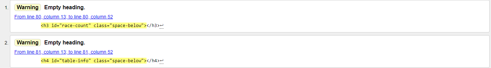

# JS Racing

View the live website [here](https://bmays9.github.io/js-racing/index.html)

This page provides users with a fun online game to play either as an individual, or for up to ten players. The game is simple, fast and different every time to encourage multiple plays.   

This site is targeted for people with an interest in racing games and fast multi-player competitions.

## User Expectations

- The website should be easy to read and game information structured intelligently.
- The website shall be compatible to devices of all screen sizes with a responsive design.
- The website shall use a consistent style of colourings and fonts.
- The game shall be intuitive and easy to follow.
- The game shall be configurable to a user's preference.
- The game shall provide various difficulty levels.

## Colours

The colour scheme for the website was chosen to be simple, with bright and bold text against a black background for accessibility reasons. 

## Typography

I have chosen to use Sora from Google fonts for the main text on the page. This sans-serif font gives the page a clean feel and makes the instructions easy to read.
Courier New is used for the game table to give a distinctive but readable feel to the area where the action takes place.

## Features

- __Search Engine Optimisation__
  - I used meta tags in the head of the page to improve the search engine optimisation and ranking, and direct traffic to the website. 

- __Setup Area__
  - This section allows users to configure the game to their own preference. Users can configure the follow options:
    - Number of players
    - Number of races
    - Player names
    - Difficulty level of each player
  - This section is hidden once the game starts to optimise space for the game area. It reappears at the end of the game to set up the new game.

- __Game Area__
  - This is where the game takes place and the game table html is populated by the JavaScript code. All of the information about the race results and overall standings are presented to the player(s). The race results are presented on a time delay and revealed in order from 10th position to 1st. The delay allows for the excitement to build as the winner is the last to be displayed.

- __Instructions__
  - This section explains to the user how to play the game and the information is split into sections for a better user experience.

## Technologies Used

Github: For version control, site hosting and for deployment.\
VS Code: The IDE I used to write my code, commit and push changes to Github.\
Code Institute: I used the Code Institute template to initiate the project in Github.\
HTML 5: Coding language used for my website.\
CSS: Used to style my website.\
JavaScript: Use for the game code.\
DevTools: Used for testing my site at all stages of the project.\
Google Fonts: Imported Sora font to style my website.\
Favicon: Used to import the icons for use in the title only.\
W3C Markup Validation Service - used to validate HTML code.\
W3C CSS Validation Service - used to validate CSS code.\
Chrome Lighthouse - used to generate Lighthouse reports.\
WAVE Accessibility tool - used to assess accessibility.\
Amiresponsive.co.uk - used for responsive design example screenshots for this readme file.\
freeformatter.com - used for formatting HTML, CSS and JavaScript code.\
webaim.org - used to check colour contrasts for accessibility.\
htmlcolorcodes.com - used for colour code screenshots for readme.\

## Testing

### Validator Testing

1. WC3 HTML Validator used to validate the HTML 5 code written on all pages of my website - no errors but two warnings found. I accept these warnings without need for changes as it references empty h3 and h4 headers. These are deliberately empty at the page load as they are populated by the JavaScript once the game is running.\
- 

2. Jigsaw CSS Validator used to validate the CSS code written for my website - no errors or warnings found.\
- 

3.  Google Chrome's Lighthouse Developer Tool used to analyse the performance and accessibility measures of my website.\
- 

4. JShint was used to validate the JavaScript code for errors. There was one warning displayed applicable to two lines of code - "Functions declared within loops referencing an outer scoped variable may lead to confusing semantics."
   I acknowledged this warning but decided against making any changes as a result. The code is working as designed and the functions declared within these loops have no issues. 
- 

### Device Testing

The website was tested by users on the following devices:
- Samsung Galaxy S8, Chrome
- Samsung Galaxy S23, Chrome
- Iphone 13 Mini, Chrome, Safari
- Ipad Air, Chrome, Safari
- Windows Desktop, Chrome, Edge

### Manual Testing

#### Setup testing:
 - Upon page loading, the game can be started with one click and no configuration changes.
   - Pass
 - The game can be played with 5 players selected.
   - Pass
 - The game can be played with 10 players selected.
   - Pass
 - Random difficulty is selected for all players by default.
   - Pass
 - Easy difficulty level results in an ability rating of 1-3.
   - Pass
 - Normal difficulty level results in an ability rating of 5-6
   - Pass
 - Hard difficulty level results in an ability rating of 8-10.
   - Pass
 - Random difficulty level results in an ability rating of 1-10.
   - Pass
 - All player names can be edited.
   - Pass
 - Player names cannot be duplicated.
   - Pass
 - Changing the number of players resets the 'editing' player back to Player 1.
   - Pass

#### In-game testing
 - A 1 race season ends after the first race.
   - Pass
 - Race countries are displayed in order.
   - Pass
 - The speed option controls the speed of the next race.
   - Pass
 - At the end of the season the player names are retained.
   - Pass
 - Multiple clicks on buttons do not affect the gameplay.
   - Pass
 - Players are awarded correct number of points for their finshing position.
   1,2,3,4,5,6,8,10,12,15
   - Pass
 - Players are awarded correct number of boost for their finishing position.
   - Pass
 - Players are ordered correctly on all game screens.
   - Pass
  

## Bugs and Fixes

- When starting a new season, the game would abort during the first race and clicking buttons did not have any effect.
  - I found that when starting the second season without altering any configuration details, the "Let's play" button was confirming the displayed player as the last edited player. Player one was always the displayed player which meant if there was 2 players, Player1 was being confirmed as the player name for player number 2. This meant that the loops for determining the finishing positions were not working as two players had the same name. TO fix it, I added a duplicate name check in the setup phase, and also now display the correct name associated with the number of players at the start of the new season. 

- Duplicate event handlers. When starting a second season after completing the game there was a bug with the game running the races twice before displaying the result.
  - The cause was found to be due to calling the setupEventListeners function when initiating the second season, duplicating the action whenever a button was clicked. The fix was to implement a season number check in the code before to  Fixed in Commit ID 34acdd32

## Deployment

I deployed my website early on Github pages.

### How to deploy the project

1. Log into Github
2. Go to the project repository.
3. In the Code and Automation section, select Pages.
4. Ensure Source = Deploy from Branch, Main Branch is selected, Folder = /(root).
5. Save deployment.
6. Go back to the Code tab, after a few minutes refresh the repository.
7. Click View Deployment to see the live site.

### How to clone the project

1. Log into Github
2. Go to the project repository at (https://github.com/bmays9/js-racing)
3. Click on the Code button and copy your preferred link.
4. Open the terminal in your code editor and change the working directory to the location you want to use for the cloned directory.
5. Type 'git clone' into the terminal, paste the link you copied and hit enter.

## How to fork the repository

1. Login to Github.
2. Go to the project repository at (https://github.com/bmays9/js-racing)
3. Click the 'Fork' button.

## Credits and References

I used the following webpages to assist with building the JavaScript code for this website.

- To find an object in an array by element
  - https://www.freecodecamp.org/news/javascript-array-of-objects-tutorial-how-to-create-update-and-loop-through-objects-using-js-array-methods/

- How to filter an array
  - https://www.digitalocean.com/community/tutorials/js-filter-array-method

- To sort an array by property
  - https://www.freecodecamp.org/news/javascript-array-of-objects-tutorial-how-to-create-update-and-loop-through-objects-using-js-array-methods/

- To hide a Div element:
  - https://www.w3schools.com/howto/howto_js_toggle_hide_show.asp

- Enabling a button
  - https://stackoverflow.com/questions/13831601/disabling-and-enabling-a-html-input-button

- How to delay calling a function.
  - based on the following code from Robinz_alumni on Code Institute Slack channel
  - From <https://app.slack.com/client/T0L30B202/search> 
`let counter = 1;`
`function printAndMaybeCancel() {`
`console.log(`Printing, number ${counter}`) ;`
`counter++;`
`if (counter > 9) {`
`clearInterval(counterInterval);`
`} `
`}`
`const counterInterval = setInterval(printAndMaybeCancel, 2000);`

